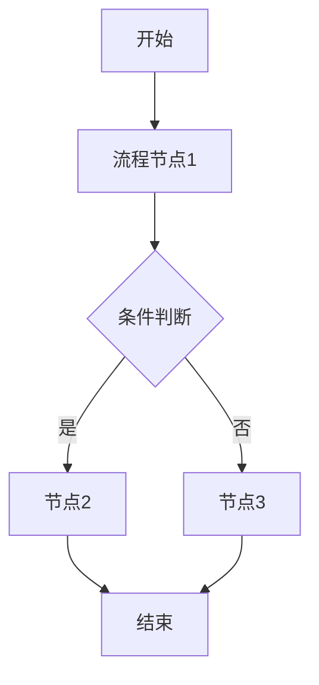

# 需求分析 Skill

## 使用场景
在 PRD 撰写前进行需求调研、分析和确认。当用户说"需求分析"、"分析需求"、"调研需求"、"帮我分析一下这个需求"时调用。

## 核心原则

1. **先分析再动笔** — 需求分析没完成，不进入 PRD 撰写阶段
2. **强制使用模板** — 按五段式结构输出：需求背景→目标确认→流程分析→功能拆解→待确认事项
3. **Mermaid 流程图** — 现状流程和目标流程都要画
4. **不猜需求** — 所有未确认的内容必须标注"待确认"，不得自行假设

## 输出规范

1. **禁止模糊表述** — 不得出现"可能"、"大概"、"待定"等未确认的描述
2. **数据流向闭环** — 每个流程节点有明确的输入和输出
3. **优先级明确** — 所有功能必须标注 Must / Should / Could / Won't

## 五段式结构

### 一、需求背景分析

**分析要点**：
- 当前业务痛点是什么？
- 受影响的用户/角色有哪些？
- 不做这个需求会有什么影响？

### 二、需求目标确认

**目标特征**：
- 具体可衡量
- 有明确的价值交付
- 可落地执行

### 三、业务流程分析

用 Mermaid 语法绘制：
- 当前流程（现状）
- 目标流程（改善后）



### 四、功能拆解清单

按表格输出：

| 终端 | 模块 | 功能 | 功能描述 | 优先级 |
|------|------|------|----------|--------|
| 商家端 | 首页 | banner轮播 | 展示促销活动 Banner，支持点击跳转 | Must |

**优先级说明**：
- Must — 必须有，否则功能不可用
- Should — 应该有，提升用户体验
- Could — 可以有，不影响核心
- Won't — 不会有，明确不在本次范围

### 五、待确认事项

| 序号 | 待确认事项 | 状态 | 负责人 | 截止日期 |
|------|------------|------|--------|----------|
| 1 | XX 功能的边界规则 | 待确认 | - | - |

**确认原则**：
- 所有 Must 级别功能必须在 PRD 撰写前完成确认
- 未确认事项不得在 PRD 中编造，必须标注"待确认"

## 工作流

```
用户需求
    ↓
requirements-analysis（需求分析）
    ↓
输出：需求分析文档（prd/需求分析/目录下）
    ↓
用户确认分析结果
    ↓
full-prd（PRD 撰写）
    ↓
输出：PRD 文档（prd/目录下）
```

## 禁止操作

1. **不可在需求不清晰时跳过** — 如背景、目标不清晰，必须主动询问用户确认
2. **不可编造未确认的需求细节** — 所有未与干系人确认的内容必须标注"待确认"